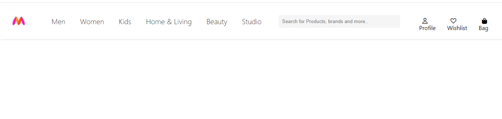

# Myntra Navbar Clone

This project is a clone of the Myntra website's navigation bar created using HTML and CSS with Flexbox.

## Table of Contents

- [Demo](#demo)
- [Features](#features)
- [Technologies Used](#technologies-used)
- [Installation](#installation)

## Demo

## Features

- Responsive design using Flexbox
- Search bar with a placeholder
- Login and Cart icons

## Technologies Used

- HTML5
- CSS3
- Flexbox

## Installation

1. Clone the repository:
  https://github.com/Nikita-developer38/Myntra_Navbar
  
